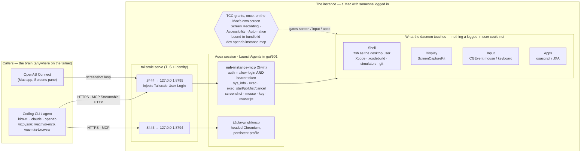

# oab-instance-mcp

The "hands and feet" half of [openabdev/openab#1544](https://github.com/openabdev/openab/issues/1544):
a thin daemon that lives in a Mac's logged-in desktop session and exposes the machine to a
coding CLI or agent elsewhere on the tailnet as **MCP servers**. Nothing here is smart; all
the intelligence stays in the caller.

> **Read before deploying.** `exec` is an unrestricted shell as the logged-in user, and `mouse` /
> `key` / `osascript` drive the desktop. Access is gated by Tailscale identity **and** a bearer
> token, nothing finer. Run this only on a Mac you own, for callers you would hand your keyboard
> to; on a shared tailnet, an allow-list of one login is the intended shape.



Read it left to right: the model and its reasoning live in the caller; the Mac only receives
tool calls, and the daemon can do nothing a logged-in user sitting at that Mac could not do.
Everything on the right is one machine — no cloud hop, no control plane; `tailscale serve`
terminates TLS on the box and stamps each request with the caller's Tailscale identity, which
the daemon checks together with a bearer token. The tools that touch the screen or inject input
are gated by macOS TCC, granted once on the Mac's own screen to the stable bundle id. The loop
the tools are built for: `screenshot` → decide → `mouse` / `key` / `osascript` / `exec` →
`screenshot` to confirm.

Two servers, one pattern: bind loopback, let `tailscale serve` do TLS and identity, run as a
LaunchAgent in the GUI session so TCC-gated things (screen, later input) work. SSH already gives
you a shell; this exists for what SSH cannot reach.

- `oab-instance-mcp` — this package. Swift, zero dependencies (Network.framework + ScreenCaptureKit).
- Browser — `@playwright/mcp`, not ours. See [`poc/pw-mcp/README.md`](poc/pw-mcp/README.md).
- Design notes: [`docs/requirements/connect-closed-loop.md`](docs/requirements/connect-closed-loop.md).

## Tools

| tool | what | notes |
|---|---|---|
| `sys_info` | host, OS, chip, displays, tailnet IPs, console user, TCC status | call first; tells the model what will work |
| `exec` | `zsh -f -c <command>` as the desktop user | `cwd` (a leading `~` is expanded and validated — a missing dir or unreadable external volume returns a clear error, not a hang), `env`, `timeout_secs` (≤600), `max_output_bytes` (≤1 MiB/stream). Spawned with `POSIX_SPAWN_SETSID`; timeout → `killpg` → exit 137, `timed_out=true`. `structuredContent` carries exit/stdout/stderr/duration. Use for commands that finish in seconds |
| `exec_start` | start a background job, return a `job_id` immediately | for work that outlives one request (release builds). Same shell/session/TCC as `exec`; `cwd`, `env`, `timeout_secs` (0 = no timeout, stop via `exec_cancel`). stdout/stderr are tee'd to `~/Library/Logs/oab-instance-mcp/jobs/<job_id>.out`/`.err` (never truncated; survive after the job is forgotten; `tail -f`-able) |
| `exec_poll` | fetch a job's state + incremental output | `job_id`, optional `stdout_since`/`stderr_since` byte offsets (from the prior poll) for only-new output; reads from the log files by seek. Terminal `state` (`exited`/`killed`) carries `exit_code`; `out_path`/`err_path` point at the files |
| `exec_list` | all running jobs + the 10 most recently finished | recover a forgotten `job_id` or see what is running; each entry has state, pid, exit_code, command, cwd, timestamps, stdout/stderr byte sizes |
| `exec_cancel` | stop a running job (or drop a finished one) | `job_id`, `signal` `KILL` (default) / `TERM` — signals the whole process group; poll once more for final output. Finished jobs are dropped from the registry (log files stay on disk) |
| `screenshot` | ScreenCaptureKit → JPEG/PNG as MCP `image` content | `display`, `scale` (px per point, default 1.0), `region` {x,y,w,h} crop in points, `format`, `quality`. Needs Screen Recording TCC. Read small UI text with `region` + `scale: 2` |
| `mouse` | CGEvent: `move` `click` `double_click` `right_click` `drag` `scroll` | coordinates in display points = screenshot pixels at scale 1. `modifiers`. Needs Accessibility TCC |
| `key` | CGEvent: `type` (unicode, layout-independent) / `press` combos (`cmd+shift+4`) | Needs Accessibility TCC |
| `osascript` | AppleScript / JXA via `/usr/bin/osascript` in the GUI session | `timeout_secs` (default 15). First script against an app raises an Automation consent dialog on the Mac — screenshot, then `mouse` click Allow |

The loop the tools are designed for: `screenshot` → decide → `mouse`/`key`/`osascript` → `screenshot` to confirm.
Verified 2026-09-22 from the laptop: open TextEdit, type a line, read it back, close via the save
sheet's Delete button located from a screenshot, quit — 0.15–0.8 s per call.

Planned: a streaming capture sink for OpenAB Connect (see requirement doc).

## Auth

Evaluated per request in `AuthPolicy`; the server refuses to start with nothing configured.
Configured checks are **AND**-combined: a request must pass every check that is set.

- `--allow-login <email>` — matches `Tailscale-User-Login`, which `tailscale serve` **injects and
  overwrites** (verified: a client-supplied header is replaced). This is the primary control.
- `--token <s>` / `--token-file <p>` — additionally require `Authorization: Bearer`, constant-time
  compared. **`deploy.sh` now generates one at `~/.config/oab-instance-mcp/token` (mode 600) and passes
  `--token-file`**, so the deployed agent requires *both* an allow-listed Tailscale login *and* the
  bearer token. This is defence-in-depth: a leaked tailnet auth key that enrols a node as
  your Tailscale login passes the login check but still gets `401` without the token (verified
  2026-09-23: no token → 401, correct token → 200, wrong token → 401). The token is stable across
  re-deploys; rotate by deleting the file and re-deploying. The menu bar shows a masked form and
  copies the full token (see below); it is never written to `agent.log`.
- `--insecure-local` — allow bare loopback requests with no Tailscale headers. Debugging only.
- `/healthz` is unauthenticated and says only `ok`.

Trust model: `exec` is a full shell as the logged-in user. `/mcp` is "my CLI on my Mac". A
sandboxed agent never gets `/mcp`; it gets a **reverse attach** with the `sandbox` profile (below).

## Lending this Mac to a sandboxed agent (reverse attach)

An agent in an `openab-pty` session cannot reach this Mac — the pod has no egress by design. So
**this Mac dials the pod** and serves MCP over that socket with a narrowed tool list. Design:
[`docs/adr/reverse-attach.md`](docs/adr/reverse-attach.md); wire contract: openab-pty
`CLIENT-CONTRACT.md` §9.

```
  Connect / Remote ──POST /attach (your credential)──► this Mac ──WS dials in──► openab-pty pod
                                                                                    └─► CLI in the session
```

```sh
# "lend my Mac to session laptop for an hour, sandbox profile"; the Mac mints the attach
# secret at the runtime with its admin credential (used once, not stored) and dials in.
curl -s -X POST -H "Authorization: Bearer $TOKEN" -H 'Content-Type: application/json' \
  -d '{"runtime":"ws://100.111.174.31:8090","session":"laptop","profile":"sandbox",
       "ttl_secs":3600,"admin_credential":"<openab-pty admin credential>"}' \
  https://macmini.<tailnet>.ts.net:8444/attach
# → 202 {"id":"…","state":"idle"|"attached",…}      GET /attach lists · DELETE /attach/{id} revokes
```

- **`/attach` uses the same `AuthPolicy` as `/mcp`** — the human's tailnet login + bearer. The grant
  lives on this Mac; the phone can be put away after the tap.
- **Profiles** are per grant and fixed for its life: `owner` = every tool; `sandbox` = no `exec*`
  (the agent already has a shell in its sandbox). Under `sandbox`, `tools/list` omits them and a
  forced `tools/call exec` is an *unknown tool* error. Widening is a new grant.
- Either `secret` (already minted by the operator at the runtime) or `admin_credential` (the Mac
  mints, TTL is the runtime's) — exactly one. A new grant for the same runtime+session replaces the
  old one; that is renewal.
- **Redial policy** (openab-pty §9.2): stop on `4001` expired · `4002` replaced · `4004` session
  ended · `4010` revoked · handshake `401`; redial with backoff (1 s → 30 s) on `1000` / `4006` /
  errors until the grant deadline. Nothing on the attached socket is trusted as identity — the
  grant is the identity; `Tailscale-User-Login` there would be pod-supplied.
- `--no-attach` disables the plane (`/attach` → 404).

Verified 2026-09-26 end to end on macmini against the openab-pty runtime (PR #38): mint via
`admin_credential`, dial, the session shell's `$OPENAB_TOOLS_MCP_URL` listed
`sys_info screenshot mouse key osascript instance_status`, `exec` refused, `sys_info` answered,
`DELETE /attach/{id}` detached.

## Build & test (on macmini; the laptop never compiles Swift)

```sh
rsync -a --delete --exclude .build --exclude .git ./ macmini:~/src/oab-instance-mcp/
ssh macmini 'cd ~/src/oab-instance-mcp && swift build -c release && swift test'
ssh macmini 'cd ~/src/oab-instance-mcp && bash scripts/smoke.sh'   # loopback, every step time-bounded
```

`~/src` is on the internal disk on purpose: `~/build` is a RAID symlink and LaunchAgents cannot
read the RAID (TCC on external volumes).

## Deploy (run on the target)

```sh
ssh macmini 'cd ~/src/oab-instance-mcp && \
  KEYCHAIN=~/Library/Keychains/signing.keychain-db KEYCHAIN_PASSWORD_FILE=~/.config/signing/keychain-password \
  bash scripts/deploy.sh you@example.com <codesign-identity-sha1>'
```

`deploy.sh` wraps the binary in `~/.local/oab-instance-mcp/oab-instance-mcp.app` (bundle id
`dev.openab.instance-mcp`) so TCC grants bind to a stable identity, signs it with the
given Apple Development identity (any cert of yours; TCC grants are keyed on identity + bundle id, so keep using the same one), installs LaunchAgent `dev.openab.instance-mcp` in `gui/501`,
and runs `tailscale serve --bg --https=8444 http://127.0.0.1:8795`.

Then, once, on the Mac's own screen, System Settings → Privacy & Security:
- Screen & System Audio Recording → enable **oab-instance-mcp**
- Accessibility → enable **oab-instance-mcp**

then `launchctl kickstart -k gui/501/dev.openab.instance-mcp`. `sys_info` reports both as `true` when
done. Grants survive re-signing with the same identity + bundle id (verified across 0.1.0→0.2.0).

Also on the Mac: `sudo pmset -a displaysleep 0`. With display sleep on, an idle Mac returns black
screenshots and, once the lock engages, drops injected input.

Client (the deployed agent requires the bearer token — copy it from the menu bar or the
`deploy.sh` summary and pass it as a header):

```sh
kiro-cli mcp add --name macmini-mcp --url https://<host>.<tailnet>.ts.net:8444/mcp \
  --header "Authorization: Bearer $(ssh macmini cat ~/.config/oab-instance-mcp/token)" \
  --scope global --timeout 30000
```

## Menu bar

With `--menu-bar` (deploy.sh sets it) the agent shows a status item: version, the public MCP URL
(click to copy), a masked bearer token line (click to copy the full token), ✓/✗ for Screen
Recording and Accessibility (click ✗ to open the pane), session / call counters with the last tool
call, Open Log, Restart, and Quit (which boots the launchd job out so KeepAlive does not bring it
back). The icon fills briefly on each tool call.

## Operate

```sh
ssh macmini 'launchctl print gui/501/dev.openab.instance-mcp | grep -E "state|pid"'
ssh macmini 'tail -20 ~/Library/Logs/oab-instance-mcp/agent.log'      # one line per session open / tools/call / deny
ssh macmini 'launchctl kickstart -k gui/501/dev.openab.instance-mcp'  # restart
ssh macmini '/Applications/Tailscale.app/Contents/MacOS/Tailscale serve status'
curl -s https://<host>.<tailnet>.ts.net:8444/healthz
ssh macmini 'ls -lt ~/Library/Logs/oab-instance-mcp/jobs/'             # exec_start job logs (<id>.out/.err), GC'd after 7 days
ssh macmini 'tail -f ~/Library/Logs/oab-instance-mcp/jobs/<job_id>.out'  # follow a background build live
```

Measured from the laptop: `sys_info` 0.75 s, `exec` 0.47 s, a 1 s exec timeout returns in 1.6 s.

## Gotchas (each one cost a cycle)

- **Keep the `LoopbackHTTPServer` a global.** Declared inside `do {}` it was released at the
  end of the block; the listener stayed bound, accepted connections, and never answered —
  the `[weak self]` handlers were no-ops. `curl` hung to its timeout with no server log line.
- **`codesign` over SSH → `errSecInternalComponent`** for anything in the login keychain, with
  or without `ssh -t`. Sign from a dedicated keychain whose password is on disk
  (`KEYCHAIN` / `KEYCHAIN_PASSWORD_FILE` in `deploy.sh`), passing `--keychain` explicitly.
- **`kiro-cli mcp add --force` truncated `~/.kiro/settings/mcp.json` to 0 bytes** the second
  time it was used in a session. Back the file up before `mcp add`, or edit it by hand.
- **macOS has no `timeout`.** Remote scripts bound steps with `perl -e 'alarm shift; exec @ARGV'`
  and `curl -m`. Write them as bash files: zsh does not word-split `$VAR`, so
  `C="curl -s -m 10"; $C …` is "command not found".
- **`tccutil reset ScreenCapture <bundle-id>` does not make the prompt appear.** After the
  first denial the system records it and further capture attempts fail silently; the grant
  has to be toggled in System Settings on the machine's own display.
- **Display sleep = black screenshots.** macmini shipped with `displaysleep 3`; the first
  screenshot after a quiet spell was solid black with a cursor. `pmset -a displaysleep 0`.
- **A stuck `osascript` is usually a consent dialog.** First AppleEvent to an app pops an
  Automation prompt on the Mac; the call blocks until answered. Over SSH the prompt is attributed
  to `sshd-keygen-wrapper` — decline those; only the agent bundle should hold Automation grants.
- **`launchctl bootout` returns before the job is gone**; an immediate `bootstrap` fails and,
  under `set -e`, took the deploy script with it — leaving no agent running. Poll until
  `launchctl print` fails before bootstrapping.
- **Model vision vs capture.** At scale 0.5 a 1080p menu bar is ~12 px tall and the model refuses
  to read it (correctly). Default is now scale 1.0; for text, crop with `region` at `scale: 2`.
- `/tmp` is `/private/tmp` — `exec` reports resolved paths.
- `zsh -f` is deliberate: the user's `.zshenv` sources a RAID-path `.cargo/env` that fails
  under launchd. Callers get a clean shell; set `env` explicitly if they need PATH additions.
- **A LaunchAgent cannot read external volumes without Full Disk Access.** A `cwd` on
  `/Volumes/…` (e.g. a RAID where builds live) does not fail with EPERM — the syscall
  *blocks*, so an un-guarded `exec` would hang to its timeout. Two fixes: `ExecCwd` time-boxes
  a readability probe and returns a clear "grant Full Disk Access to dev.openab.instance-mcp"
  error instead of hanging; and granting FDA to the bundle in System Settings → Privacy &
  Security → Full Disk Access makes the volume readable (verified 2026-09-23: same `ls
  /Volumes/…` went from a 15 s timeout to 39 ms). The grant sticks across re-signing like the
  Screen Recording / Accessibility ones. `exec_start` builds on the RAID work once FDA is granted.
