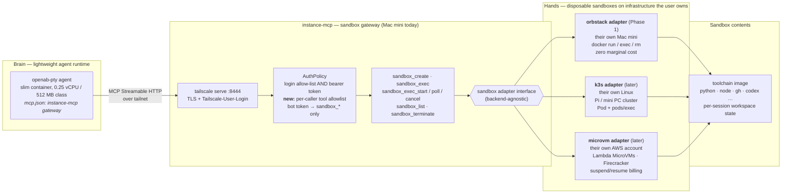

# ADR: Sandbox Adapter

- **Status:** Proposed
- **Date:** 2026-09-24
- **Issue:** [#1](https://github.com/openabdev/instance-mcp/issues/1)
- **Related:** [openabdev/openab#1544](https://github.com/openabdev/openab/issues/1544) (brain/hands split)

## Context

OpenAB agent images are deliberately slim — some coding CLIs are not bundled, yet agents still need a full toolchain (Python, Node.js, gh, codex, …) to do real work. Bundling the toolchain into every agent image bloats it and couples agent deployment to toolchain updates.

instance-mcp is already the "hands" half of the brain/hands split: a thin MCP daemon on a Mac that a remote agent calls over the tailnet. But its `exec` tool is an unrestricted shell as the logged-in user. The README states the open problem:

> Before a sandboxed OAB bot gets this endpoint it needs a tool allowlist and its own token — not built.

We need a way for an OAB agent — running in a lightweight container (0.25 vCPU / 512 MB class), wherever it is hosted — to execute tool calls in isolated, disposable environments, on infrastructure the user owns, without ever holding raw host access.

## Decision

We will add a **`sandbox_*` MCP tool family** to instance-mcp, backed by a **sandbox adapter** interface (the classic adapter pattern): one stable tool schema, translated by pluggable adapters to concrete backends.

An OAB agent's tool calls execute on infrastructure the user owns and chooses:

1. **OrbStack on their own Mac mini** — existing hardware, zero marginal cost (Phase 1)
2. **k3s on their own Linux** — Raspberry Pi, Intel mini PC, or a mixed self-hosted cluster (later)
3. **Lambda MicroVMs in their own AWS account** — Firecracker isolation, pay-per-second, no hardware (later)

Same agent, same `sandbox_*` tools — the user picks where the code actually runs and can switch backends without touching the agent. No code or credentials leave the user's trust boundary; no third-party sandbox service is involved.

### Architecture



Read it left to right: the model and its reasoning live in the agent container; the gateway only receives MCP tool calls and translates them through a stable adapter interface; each sandbox is a disposable environment holding the fat toolchain, so the agent image stays slim. Raw host tools (`exec`, `mouse`, `key`, `osascript`) remain owner-token-only — a bot token can only reach the `sandbox_*` surface.

### Tool schema

All tools reuse the semantics already established by the `exec` family (`timeout` → `killpg` → exit 137, `structuredContent` with exit/stdout/stderr/duration, job registry with byte-offset incremental polling).

| Tool | Description |
|---|---|
| `sandbox_create` | Create a sandbox from a named image/template. Returns `sandbox_id`. Params: `image`, optional `name`, `env`, `ttl_secs` (auto-reap). |
| `sandbox_exec` | Run a command to completion inside a sandbox. Params: `sandbox_id`, `command`, `cwd`, `env`, `timeout_secs`, `max_output_bytes`. |
| `sandbox_exec_start` | Start a background job inside a sandbox; returns `job_id`. |
| `sandbox_exec_poll` | Poll a job with `stdout_since` / `stderr_since` byte offsets (same contract as `exec_poll`). |
| `sandbox_exec_cancel` | Signal a job (`KILL` default / `TERM`), process-group wide. |
| `sandbox_list` | List sandboxes with state, image, created_at, resource usage. |
| `sandbox_terminate` | Destroy a sandbox and release resources. |

The schema must not leak backend details. The lifecycle (`PENDING` / `RUNNING` / `TERMINATED` on `sandbox_create` / `sandbox_list`) is designed in from day one, since some backends are async.

### Adapters

**OrbStack adapter — their own Mac mini (Phase 1)**

- `sandbox_create` → `docker run -d <image> sleep infinity` (or `orbctl create` for machine-level isolation)
- `sandbox_exec` → `docker exec`
- `sandbox_terminate` → `docker rm -f`
- Zero marginal cost; containers share the OrbStack Linux VM kernel (acceptable for trusted/semi-trusted OpenAB workloads).

**k3s adapter — their own Linux (later)**

| Tool | k3s implementation |
|---|---|
| `sandbox_create` | Create a Pod (`sleep infinity`); `ttl_secs` → `activeDeadlineSeconds` |
| `sandbox_exec` | `pods/exec` subresource (streaming WebSocket/SPDY, as behind `kubectl exec`) |
| `sandbox_exec_start` / `poll` | nohup + tee to files inside the pod; poll reads byte offsets via exec |
| `sandbox_list` | List pods by label selector |
| `sandbox_terminate` | Delete pod |

Per-sandbox CPU/RAM quotas, multi-node scheduling, and rescheduling come free from Kubernetes. The gateway only needs a kubeconfig and can run anywhere on the tailnet. Multi-arch toolchain images required (`docker buildx`; Pi = arm64, Intel = amd64). Isolation is shared-kernel, same tier as OrbStack; upgradeable to kata-containers without changing the adapter interface.

**MicroVM adapter — their own AWS account (later)**

The adapter calls `run-microvm` / JWE auth token / suspend-resume idle policy for Firecracker-level isolation and pay-per-second billing, entirely within the user's own AWS account.

- Announcement (2026-06): <https://aws.amazon.com/about-aws/whats-new/2026/06/aws-lambda-microvms/>
- Developer guide: <https://docs.aws.amazon.com/lambda/latest/dg/lambda-microvms-guide.html>
- Why it fits: VM-level isolation for untrusted/AI-generated code, snapshot-based near-instant launch/resume, suspend on idle (compute charges stop; snapshot storage only), dedicated per-VM HTTPS endpoint supporting HTTP/2, gRPC, WebSockets. Available in us-east-1, us-east-2, us-west-2, ap-northeast-1, eu-west-1 (ARM64).

### Adapter matrix

```
sandbox_* schema (stable)
 ├─ orbstack adapter  → their own Mac mini (existing hardware, Phase 1)
 ├─ k3s adapter       → their own Linux: Pi / mini PC / mixed cluster (self-hosted scale-out)
 └─ microvm adapter   → their own AWS account: Lambda MicroVMs (strong isolation + per-second billing)
```

### Auth changes

- Per-caller tokens with a tool allowlist (e.g. token file entries of the form `token:tool-glob`), evaluated in `AuthPolicy` alongside the existing Tailscale login + bearer checks.
- The existing owner token keeps full access; a new bot token is restricted to `sandbox_*` (and optionally `sys_info`).

## Consequences

**Positive**

- Agent images stay slim; toolchain updates are decoupled from agent deployment.
- A bot-scoped token's blast radius is a disposable sandbox — resolves the README's trust-model TODO.
- The architecture is validated at zero marginal cost (OrbStack) before any paid backend is built.
- Backends are swappable without agent changes; the user always owns the execution infrastructure.

**Negative / accepted trade-offs**

- Phase 1 isolation is shared-kernel (OrbStack containers), not VM-level; untrusted third-party code is out of scope until the MicroVM adapter.
- One Mac mini is a capacity ceiling and a single point of failure in Phase 1.
- Every tool call adds a network round-trip versus in-process execution.
- Later adapters (k3s, MicroVMs) imply a Linux gateway implementation distinct from the Swift/macOS codebase; the tool schema and acceptance tests are the shared contract.

## Non-goals

- Exposing sandbox network ports to the tailnet (all access is mediated by `sandbox_exec`).
- Multi-host scheduling / autoscaling in Phase 1.
- Untrusted third-party code execution (MicroVM-adapter threat model).

## Acceptance criteria

- A bot-scoped token restricted to `sandbox_*` can create a sandbox, run `sandbox_exec` with poll semantics, and terminate it; the same token is denied on `exec`, `mouse`, `key`, `osascript`.
- `sandbox_exec` timeout kills the process group inside the container and reports `timed_out=true`, exit 137.
- `ttl_secs` reaps forgotten sandboxes; `sandbox_list` reflects lifecycle states.
- Verified end-to-end from a remotely-hosted openab-pty over the tailnet (`tailscale serve :8444`).
