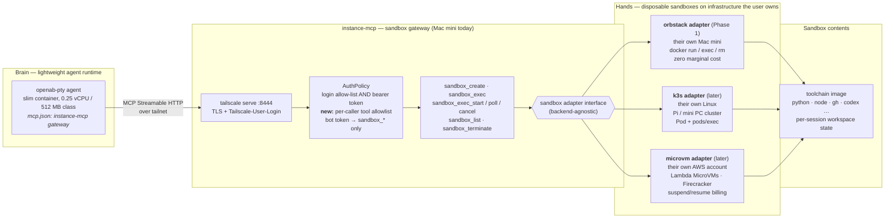

# ADR: Sandbox Adapter

- **Status:** Proposed
- **Date:** 2026-09-24
- **Issue:** [#1](https://github.com/openabdev/instance-mcp/issues/1)
- **Related:** [openabdev/openab#1544](https://github.com/openabdev/openab/issues/1544) (brain/hands split)

## Context

OpenAB (OAB) agent images are deliberately slim — some coding CLIs are not bundled, yet agents still need a full toolchain (Python, Node.js, gh, codex, …) to do real work. Bundling the toolchain into every agent image bloats it and couples agent deployment to toolchain updates.

instance-mcp is already the "hands" half of the brain/hands split: a thin MCP daemon on a Mac that a remote agent calls over the tailnet. But its `exec` tool is an unrestricted shell as the logged-in user. The README states the open problem:

> Before a sandboxed OAB bot gets this endpoint it needs a tool allowlist and its own token — not built.

We need a way for an OAB agent — running in a lightweight container (0.25 vCPU / 512 MB class), wherever it is hosted — to execute tool calls in isolated, disposable environments, on infrastructure the user owns, without ever holding raw host access.

### Inspiration

This design is inspired by [AWS Lambda MicroVMs](https://aws.amazon.com/about-aws/whats-new/2026/06/aws-lambda-microvms/) (announced 2026-06): disposable, VM-isolated, snapshot-launched sandboxes purpose-built for running user- or AI-generated code, with suspend-on-idle billing. We generalize the same "disposable sandbox for the toolchain" idea into a backend-agnostic adapter, so it runs not only on AWS but also on the user's own hardware.

## Alternatives considered

| Alternative | Why rejected |
|---|---|
| **Bundle the toolchain into every agent image** | Image bloat; every toolchain update forces an agent redeploy; one image per toolchain combination; no isolation between the agent process and tool execution. |
| **Third-party sandbox services (E2B, Modal, …)** | Code and credentials leave the user's trust boundary; per-seat/per-second vendor cost; vendor lock-in. Owning the execution infrastructure is a core requirement. |
| **Give bots the existing raw `exec` on the gateway host** | An unrestricted shell as the logged-in user — exactly the trust-model TODO this ADR resolves. No isolation, no resource limits, blast radius is the whole machine. |
| **Agent talks to backends directly (no gateway)** | Every agent must hold backend credentials (docker socket, kubeconfig, AWS keys) and implement per-backend logic; MCP config becomes dynamic per session; no single enforcement point for auth or resource caps. |

## Decision

We will add a **`sandbox_*` MCP tool family** to instance-mcp, backed by a **sandbox adapter** interface (the classic adapter pattern): one stable tool schema, translated by pluggable adapters to concrete backends.

An OAB agent's tool calls execute on infrastructure the user owns and chooses:

1. **OrbStack on their own Mac mini** — existing hardware, zero marginal cost (Phase 1)
2. **k3s on their own Linux** — Raspberry Pi, Intel mini PC, or a mixed self-hosted cluster (later)
3. **Lambda MicroVMs in their own AWS account** — Firecracker isolation, pay-per-second, no hardware (later)

Same agent, same `sandbox_*` tools — the user picks where the code actually runs and can switch backends without touching the agent. No code or credentials leave the user's trust boundary; no third-party sandbox service is involved.

### Architecture



Read it left to right: the model and its reasoning live in the agent container; the gateway only receives MCP tool calls and translates them through a stable adapter interface; each sandbox is a disposable environment holding the fat toolchain, so the agent image stays slim. Raw host tools (`exec`, `mouse`, `key`, `osascript`) remain owner-token-only — a bot token can only reach the `sandbox_*` surface.

### Tool schema

All tools reuse the semantics already established by the `exec` family (`timeout` → `killpg` → exit 137, `structuredContent` with exit/stdout/stderr/duration, job registry with byte-offset incremental polling).

| Tool | Description |
|---|---|
| `sandbox_create` | Create a sandbox from a named image/template. Returns `sandbox_id`. Params: `image`, optional `name`, `env`, `ttl_secs` (see semantics below), `cpu`, `memory_mb`. |
| `sandbox_exec` | Run a command to completion inside a sandbox. Params: `sandbox_id`, `command`, `cwd`, `env`, `timeout_secs`, `max_output_bytes`. |
| `sandbox_exec_start` | Start a background job inside a sandbox; returns `job_id`. |
| `sandbox_exec_poll` | Poll a job with `stdout_since` / `stderr_since` byte offsets (same contract as `exec_poll`). |
| `sandbox_exec_cancel` | Signal a job (`KILL` default / `TERM`), process-group wide. |
| `sandbox_list` | List the **caller's own** sandboxes with state, image, created_at, resource usage. |
| `sandbox_terminate` | Destroy a sandbox and release resources. |

The schema must not leak backend details.

**Ownership.** Every sandbox is owned by the caller identity (token) that created it. `sandbox_list` returns only the caller's sandboxes; `sandbox_exec*` and `sandbox_terminate` on a sandbox owned by another caller fail with `denied` — a sandbox belonging to caller B is unaddressable and invisible to caller A. The owner token may address all sandboxes for operational cleanup.

**Lifecycle.** States: `PENDING → RUNNING → TERMINATED`, plus `FAILED` for creations that never reach `RUNNING` (e.g. image pull error). Edges: `PENDING → RUNNING` (provisioning succeeded), `PENDING → FAILED` (provisioning error), `PENDING → TERMINATED` (caller terminates during provisioning — the adapter cancels/cleans up), `RUNNING → TERMINATED`. `sandbox_terminate` is valid in any non-terminal state and idempotent in terminal states. `FAILED` and `TERMINATED` carry a `state_reason` (`user_requested`, `ttl_expired`, `create_error: <detail>`, `external`, …). Reaped and failed sandboxes remain visible in `sandbox_list` for a retention window (with their `state_reason`) so callers can distinguish "I terminated it" from "it was reaped" from "it never started".

**`ttl_secs` semantics.** Absolute maximum lifetime — a safety net against forgotten sandboxes, not an idle timer. **The clock starts at the gateway's acceptance of `sandbox_create`** (the timestamp is recorded in backend metadata at creation), so `PENDING` time counts toward the TTL and reap time is deterministic across adapters, async or not. It terminates the sandbox even mid-job; callers running long jobs should size `ttl_secs` accordingly and terminate explicitly when done. (This matches k3s `activeDeadlineSeconds` and the MicroVM 8-hour maximum duration. Idle-based reaping is a possible future extension and would be a separate parameter.)

**Resources.** `cpu` / `memory_mb` on `sandbox_create` are optional requests, clamped to gateway-configured per-sandbox maximums; when omitted, gateway-configured defaults apply. This keeps the k3s quota claim honest: quotas are set from these schema-level values, not invented per backend.

### Sandbox constraints (all adapters)

The "blast radius is a disposable sandbox" claim only holds if every adapter enforces the following defaults. These are part of the adapter contract, not implementation details:

| Constraint | Default | Rationale |
|---|---|---|
| Host filesystem | **No host mounts.** Workspace lives inside the sandbox; data moves in/out via `sandbox_exec` (e.g. `git clone`, stdin/stdout). | A stolen bot token must not read host files. |
| CPU | Hard limit per sandbox (OrbStack: `--cpus`; k3s: `resources.limits.cpu`; MicroVM: baseline sizing). | Prevent starving the host / other sandboxes. |
| Memory | Hard limit per sandbox (OrbStack: `--memory`; k3s: `resources.limits.memory`). | Prevent OOM-ing the host. |
| PIDs | Limit per sandbox (OrbStack: `--pids-limit`; k3s: pod PID limit). | Fork-bomb containment. |
| Network | **No host/tailnet network access** (OrbStack: dedicated bridge network, never `--network host`; k3s: NetworkPolicy denying cluster/tailnet CIDRs). Public internet egress is allowed by default (toolchains need package registries and git remotes) and can be tightened per deployment. | A sandbox must not reach the gateway, other tailnet nodes, or the host's services. |
| Privileges | No privileged mode, no added capabilities, no docker socket mount. | Container escape hardening. |
| Concurrency | Per-caller cap on live sandboxes (gateway-enforced). | Bound total resource exposure from one token. |
| `ttl_secs` cap | Gateway-configured maximum; requests above the cap are **rejected** with a typed `ttl_exceeds_cap` error (never silently clamped). | Bound resource-holding DoS; deterministic caller-visible behavior. |

### The adapter contract

Each adapter implements the following operations. This table — not the mermaid node — is the interface; the MCP layer is a thin translation on top of it.

| Operation | Semantics | Typical errors |
|---|---|---|
| `create(image, env, ttl, cpu, memory) → sandbox` | Provision and start; may return `PENDING` (async backends). | `image_not_found`, `capacity_exceeded`, `backend_unavailable` |
| `exec(sandbox, cmd, cwd, env, timeout) → result` | Run to completion; enforce timeout → kill process group → exit 137. | `sandbox_not_found`, `sandbox_not_running` |
| `exec_start(sandbox, cmd, …) → job_id` | Start background job; stdout/stderr captured to files inside the sandbox. | same as `exec` |
| `exec_poll(sandbox, job_id, offsets) → state + incremental output` | Byte-offset reads of the job's output files. | `job_not_found` |
| `exec_cancel(sandbox, job_id, signal)` | Signal the job's process group. | `job_not_found` |
| `list(owner) → sandboxes` | Sandboxes with state, `state_reason`, resource usage. | — |
| `terminate(sandbox)` | Destroy; idempotent. | `sandbox_not_found` |

Errors are typed and backend-neutral; adapters map backend-specific failures onto this error model. Caller-facing authorization (`denied`) is enforced by the gateway before the adapter is invoked.

**State of record.** Ownership, creation timestamp, and `ttl_secs` are stored as **backend metadata at creation time** (OrbStack/docker: container labels `oab.owner` / `oab.created_at` / `oab.ttl_secs`; k3s: pod labels/annotations; MicroVM: resource tags). The gateway's in-memory registry is a rebuildable cache, never the source of truth. Consequences:

- **Restart recovery:** on startup the gateway rebuilds ownership and state by listing the backend and reading metadata — no orphaned sandboxes.
- **Reaper survives restarts:** the TTL reaper computes deadlines from backend metadata (`created_at + ttl_secs`), not from in-memory timers, so the "TTL is the backstop" guarantee holds across gateway restarts.
- **Reconciliation:** a periodic pass compares registry against backend truth; sandboxes killed externally (manual `docker kill`, OOM, host reboot) are marked `TERMINATED` with `state_reason: external`, and stale registry entries with no backend counterpart are pruned. Retention-window bookkeeping for `FAILED`/`TERMINATED` entries is gateway-local and best-effort — after a restart, terminal-state history may be lost, but live-sandbox correctness never depends on it.

**Job state does not survive gateway restarts (explicit boundary).** The `job_id → sandbox` registry is gateway-local by design. After a gateway restart, `exec_poll` / `exec_cancel` for a pre-restart job return `job_not_found` — deterministically, never a wrong job's output. The job's process may still be running inside the sandbox (it was started with `setsid`), and its output files persist at the documented path (`/var/log/oab-jobs/<job_id>.{out,err}`), so a caller receiving `job_not_found` should treat the outcome as unknown and recover via `sandbox_exec`: inspect the output files, check for the process, and kill or re-run as appropriate. Backend-persisting job metadata (e.g. labels) to make job control survive restarts is a possible future extension, not a Phase 1 guarantee.

### Adapters

**OrbStack adapter — their own Mac mini (Phase 1)**

- `create` → `docker run -d --network oab-sandbox --cpus <n> --memory <m> --pids-limit <p> --security-opt no-new-privileges <image> sleep infinity` (or `orbctl create` for machine-level isolation). No host volumes, no `--privileged`, no docker socket. `oab-sandbox` is a dedicated bridge network with no route to the host or tailnet.
- `exec` → `docker exec`
- `exec_start` / `poll` / `cancel` → `docker exec -d` wrapping the command with `setsid … > /var/log/oab-jobs/<job_id>.out 2> ….err`; poll reads byte offsets via `docker exec dd`; cancel signals the process group — the same job contract as the host `exec_start` family, executed inside the container.
- `list` → `docker ps --filter label=oab.owner=<owner>` (filtered by owner **value**, with gateway-side re-filtering as defense in depth, so other owners' sandboxes never appear) — labels are the state of record; the gateway registry is a cache rebuilt from them (see "State of record")
- `terminate` → `docker rm -f`
- Zero marginal cost; containers share the OrbStack Linux VM kernel (acceptable for trusted/semi-trusted OpenAB workloads).

**k3s adapter — their own Linux (later)**

| Operation | k3s implementation |
|---|---|
| `create` | Create a Pod (`sleep infinity`); `ttl_secs` → `activeDeadlineSeconds`; `cpu`/`memory_mb` → `resources.limits` |
| `exec` | `pods/exec` subresource (streaming WebSocket/SPDY, as behind `kubectl exec`) |
| `exec_start` / `poll` / `cancel` | nohup + tee to files inside the pod; poll reads byte offsets via exec |
| `list` | List pods by label selector |
| `terminate` | Delete pod |

Multi-node scheduling and rescheduling come free from Kubernetes; per-sandbox quotas come from the schema-level `cpu`/`memory_mb` values. The gateway only needs a kubeconfig and can run anywhere on the tailnet. Multi-arch toolchain images required (`docker buildx`; Pi = arm64, Intel = amd64). Isolation is shared-kernel, same tier as OrbStack; upgradeable to kata-containers without changing the adapter interface.

**MicroVM adapter — their own AWS account (later)**

The adapter calls `run-microvm` / JWE auth token / suspend-resume idle policy for Firecracker-level isolation and pay-per-second billing, entirely within the user's own AWS account.

- Announcement (2026-06): <https://aws.amazon.com/about-aws/whats-new/2026/06/aws-lambda-microvms/>
- Developer guide: <https://docs.aws.amazon.com/lambda/latest/dg/lambda-microvms-guide.html>
- Why it fits: VM-level isolation for untrusted/AI-generated code, snapshot-based near-instant launch/resume, suspend on idle (compute charges stop; snapshot storage only), dedicated per-VM HTTPS endpoint supporting HTTP/2, gRPC, WebSockets. Available in us-east-1, us-east-2, us-west-2, ap-northeast-1, eu-west-1 (ARM64).

### Adapter matrix

```
sandbox_* schema (stable)
 ├─ orbstack adapter  → their own Mac mini (existing hardware, Phase 1)
 ├─ k3s adapter       → their own Linux: Pi / mini PC / mixed cluster (self-hosted scale-out)
 └─ microvm adapter   → their own AWS account: Lambda MicroVMs (strong isolation + per-second billing)
```

### Auth changes

- Per-caller tokens with a tool allowlist, evaluated in `AuthPolicy` alongside the existing Tailscale login + bearer checks.
- **Tokens at rest are stored as SHA-256 hashes** (constant-time compare of the hash), never plaintext. Rotation: delete the entry and issue a new token. Revocation: delete the entry; takes effect on the next request.
- **Allowlist semantics: anchored glob, default deny, fail closed.** A pattern matches the whole tool name (`sandbox_*` matches `sandbox_exec`, not `xsandbox_exec`). A token with no allowlist entry is denied all tools. Any error parsing or evaluating the allowlist denies the request.
- The existing owner token keeps full access; a new bot token is restricted to `sandbox_*`. `sys_info` may optionally be granted for capability discovery — note it reveals host metadata (OS, chip, displays, tailnet IPs, console user, TCC status), which is why it is opt-in rather than default for bot tokens.

### Threat model (Phase 1)

Phase 1 callers are **semi-trusted**: our own bots running our own or AI-assisted code. The primary threat is a **stolen bot token**. Mitigations: the tool allowlist bounds the API surface to `sandbox_*`; ownership scoping prevents enumeration or termination of other callers' sandboxes; the sandbox constraints table bounds filesystem, network, resource, and privilege reach; the per-caller concurrency and TTL caps bound resource-holding.

What Phase 1 does **not** defend against: a kernel exploit from inside a sandbox (shared-kernel OrbStack containers), which could reach other sandboxes in the same OrbStack VM. This lateral-movement risk is an **accepted trade-off** for Phase 1's semi-trusted callers. Running genuinely untrusted third-party code requires the MicroVM adapter's VM-level isolation and is out of scope until then.

## Consequences

**Positive**

- Agent images stay slim; toolchain updates are decoupled from agent deployment.
- A bot-scoped token's blast radius is a disposable sandbox — **provided the sandbox constraints above are enforced** — resolving the README's trust-model TODO.
- The architecture is validated at zero marginal cost (OrbStack) before any paid backend is built.
- Backends are swappable without agent changes; the user always owns the execution infrastructure.

**Negative / accepted trade-offs**

- Phase 1 isolation is shared-kernel (OrbStack containers), not VM-level; a kernel escape can move laterally within the OrbStack VM (see Threat model).
- One Mac mini is a capacity ceiling and a single point of failure in Phase 1.
- Every tool call adds a network round-trip versus in-process execution.
- Later adapters (k3s, MicroVMs) imply a Linux gateway implementation distinct from the Swift/macOS codebase; the tool schema and acceptance tests are the shared contract.

## Non-goals

- Exposing sandbox network ports to the tailnet (all access is mediated by `sandbox_exec`).
- Multi-host scheduling / autoscaling in Phase 1.
- Executing genuinely untrusted third-party code in Phase 1 (see Threat model — requires the MicroVM adapter).

## Acceptance criteria

- A bot-scoped token restricted to `sandbox_*` can create a sandbox, run `sandbox_exec` with poll semantics, and terminate it; the same token is denied on `exec`, `mouse`, `key`, `osascript`.
- **Default deny:** a token with no allowlist entry is denied every tool.
- **Ownership:** bot token A cannot `sandbox_list`, `sandbox_exec`, or `sandbox_terminate` a sandbox created by bot token B.
- Sandbox constraints are enforced and negatively tested: no host filesystem visible from inside the sandbox; a fork bomb hits the PID limit without affecting the host; memory allocation beyond the limit is killed inside the sandbox; the gateway and tailnet addresses are unreachable from inside the sandbox; creating sandboxes beyond the per-caller cap is rejected; a `ttl_secs` above the gateway cap is **rejected with `ttl_exceeds_cap`**.
- **Restart recovery:** after a gateway restart, a pre-existing sandbox is still listed with its owner, remains addressable by that owner only, and is still reaped at its original `created_at + ttl_secs` deadline. A sandbox killed externally while the gateway was down appears as `TERMINATED` with `state_reason: external` after reconciliation. `exec_poll` for a pre-restart job returns `job_not_found` (never another job's output), and the job's output files remain retrievable via `sandbox_exec` at `/var/log/oab-jobs/<job_id>.{out,err}`.
- `sandbox_exec` timeout kills the process group inside the container and reports `timed_out=true`, exit 137.
- `ttl_secs` reaps forgotten sandboxes; `sandbox_list` reflects lifecycle states including `FAILED` and `state_reason`.
- A failed creation (e.g. nonexistent image) surfaces as `FAILED` with a `create_error` reason, distinguishable from `TERMINATED`.
- **CI-runnable variant:** the full suite runs against a loopback gateway (no tailnet required); the tailnet end-to-end path from a remotely-hosted openab-pty (`tailscale serve :8444`) is verified manually per release.
