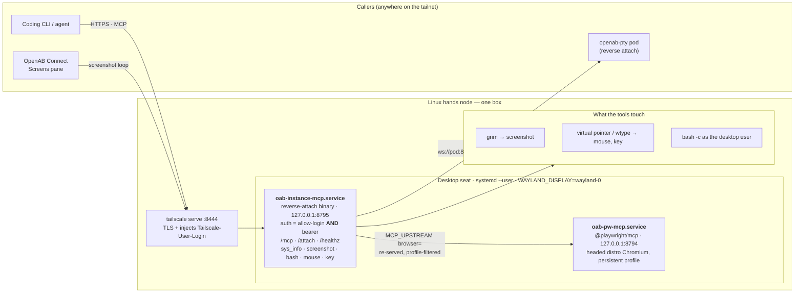
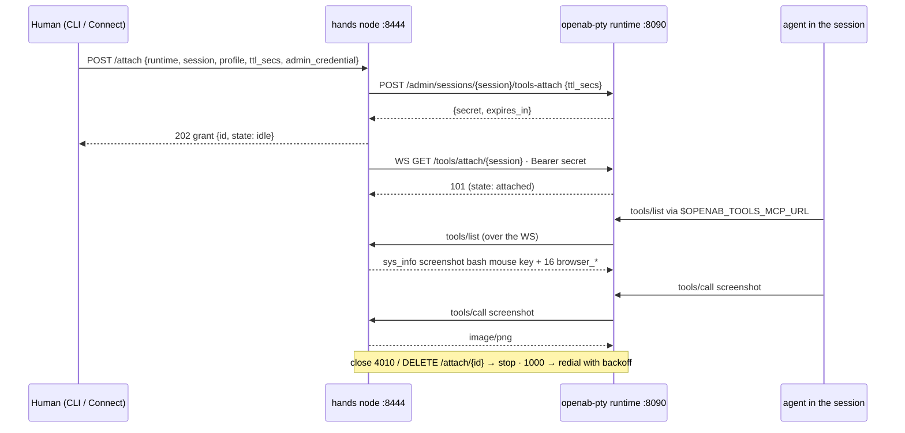

# Linux hands node setup

How to turn a Linux desktop box into an `oab-instance-mcp` hands node with the Rust PoC in
[`poc/reverse-attach-linux/`](../poc/reverse-attach-linux/). Written from two deployments,
both verified end to end on 2026-09-28 (lending to an openab-pty session, the OpenAB Connect
Screens pane, browser tools):

- `rpi1` — Raspberry Pi OS / Debian 13, aarch64, the stock labwc desktop (a display exists).
- `black` — Ubuntu 24.04 Server, Intel N95, **no desktop at all**: a headless sway seat is created
  by the installer (`--headless-seat`).

Read the trust warning at the top of the [README](../README.md) first. On Linux it is stricter,
not looser: `bash` is offered in **both** profiles, so anyone who can attach this node gets a
shell as the user running the daemon.

## What you end up with



Two systemd **user** units with linger enabled, both binding loopback only; `tailscale serve`
terminates TLS and stamps the caller's Tailscale identity. Same shape as the Mac.

## Prerequisites

- A **wlroots compositor** as the seat (labwc, sway, wayfire): the daemon shells out to `grim`
  (screenshot) and `wtype` (keyboard) and holds its own virtual pointer, which need the compositor's
  `wlr-screencopy`, `virtual-pointer` and `virtual-keyboard` protocols. GNOME/Mutter and KDE do
  not expose these. Two ways to have one:
  - a desktop already running on seat0 (Raspberry Pi OS labwc, a sway login) — see
    [Raspberry Pi notes](#raspberry-pi-notes) for the no-monitor case;
  - **none** — pass `--headless-seat` to the installer and it runs `sway` with the headless
    wlroots backend as user unit `oab-seat.service`: one 1920×1080 virtual output, no input
    devices, no GPU or monitor needed (verified on `black`, Ubuntu 24.04 Server).
- The node on the tailnet with **MagicDNS + HTTPS certificates** enabled (needed for
  `tailscale serve`). Do **not** do this on a k3s node that hosts openab-pty pods: host-level
  `tailscaled` gives every pod tailnet egress as the node (measured, see
  [`docs/adr/reverse-attach.md`](adr/reverse-attach.md)).
- Rust ≥ 1.85 (`rustup`), `sudo`.

```sh
sudo apt-get install -y grim wlrctl wtype nodejs npm        # + sway for --headless-seat
sudo apt-get install -y chromium                             # Debian / Raspberry Pi OS only
```

Debian 13 ships `nodejs` 20 and `npm` 9, which is enough for `@playwright/mcp`. Ubuntu has no
`chromium` deb (snap only, unusable from a user unit); the installer downloads Playwright's
Chromium instead and handles the AppArmor rule it needs (see [Gotchas](#gotchas)).

## 1. Tailscale

```sh
curl -fsSL https://pkgs.tailscale.com/stable/debian/$(. /etc/os-release; echo $VERSION_CODENAME).noarmor.gpg \
  | sudo tee /usr/share/keyrings/tailscale-archive-keyring.gpg >/dev/null
curl -fsSL https://pkgs.tailscale.com/stable/debian/$(. /etc/os-release; echo $VERSION_CODENAME).tailscale-keyring.list \
  | sudo tee /etc/apt/sources.list.d/tailscale.list >/dev/null
sudo apt-get update && sudo apt-get install -y tailscale
sudo tailscale up --hostname="$(hostname)" --accept-dns=false --accept-routes=false
```

`tailscale up` prints a login URL; approve it in the browser (or pass `--authkey`). If it hangs
with no URL at all, check `curl -4 -m 8 https://controlplane.tailscale.com/` — see
[Gotchas](#gotchas).

## 2. Get the daemon

**Prebuilt (preferred).** Every `v*` release ships `oab-instance-mcp-VERSION-linux-arm64.tar.gz`
and `-linux-amd64.tar.gz` (built and smoke-tested in CI on native runners) beside the macOS
installer, with a `.sha256` each:

```sh
V=$(curl -fsSL https://api.github.com/repos/openabdev/instance-mcp/releases/latest | python3 -c 'import sys,json;print(json.load(sys.stdin)["tag_name"][1:])')
A=$(dpkg --print-architecture)          # arm64 or amd64
curl -fsSLO "https://github.com/openabdev/instance-mcp/releases/download/v$V/oab-instance-mcp-$V-linux-$A.tar.gz"
curl -fsSLO "https://github.com/openabdev/instance-mcp/releases/download/v$V/oab-instance-mcp-$V-linux-$A.tar.gz.sha256"
sha256sum -c "oab-instance-mcp-$V-linux-$A.tar.gz.sha256"
tar xzf "oab-instance-mcp-$V-linux-$A.tar.gz" && cd "oab-instance-mcp-$V-linux-$A"
./install-linux.sh            # does steps 3–5 below; --allow-login / --no-browser / --port
./install-linux.sh --headless-seat   # same, on a box with no desktop (creates oab-seat.service)
```

`install-linux.sh` is idempotent: it keeps an existing token, detects your Tailscale login,
writes both user units, installs `@playwright/mcp` when `node`/`chromium` are present, enables
linger and `tailscale serve`. If it did everything, skip to [Verify](#6-verify-from-another-tailnet-machine);
steps 3–5 describe what it did.

**From source** (needs Rust ≥ 1.85):

```sh
git clone https://github.com/openabdev/instance-mcp ~/repo/instance-mcp
cd ~/repo/instance-mcp/poc/reverse-attach-linux
cargo build --release              # ~30 s cold on a Pi 4/5; 2.2 MB binary
bash smoke.sh                      # 38 checks against the bundled mock runtime; all must pass
```

`smoke.sh` runs the binary with `MCP_INSECURE_LOCAL=1` against `mock_runtime.py` on loopback.
It does not need the desktop or the network, so run it first when something is off. The same
smoke runs in CI on amd64 and arm64 for every push.

## 3. Bearer token and the daemon unit

```sh
mkdir -p ~/.config/oab-instance-mcp
head -c 32 /dev/urandom | base64 | tr -d '=+/\n' | head -c 40 > ~/.config/oab-instance-mcp/token
chmod 600 ~/.config/oab-instance-mcp/token

LOGIN=$(sudo tailscale status --json | python3 -c \
  'import sys,json;d=json.load(sys.stdin);print(d["User"][str(d["Self"]["UserID"])]["LoginName"])')

mkdir -p ~/.config/systemd/user
cat > ~/.config/systemd/user/oab-instance-mcp.service <<EOF
[Unit]
Description=oab-instance-mcp (Rust hands node: /mcp + /attach)
After=graphical-session.target

[Service]
ExecStart=%h/.local/oab-instance-mcp/oab-instance-mcp   # or …/target/release/reverse-attach from source
Environment=BIND=127.0.0.1:8795
Environment=MCP_TOKEN_FILE=%h/.config/oab-instance-mcp/token
Environment=MCP_ALLOW_LOGIN=$LOGIN
Environment=MCP_UPSTREAM=browser=http://127.0.0.1:8794/mcp
Environment=WAYLAND_DISPLAY=wayland-0
Environment=XDG_RUNTIME_DIR=/run/user/%U
Restart=always
RestartSec=2

[Install]
WantedBy=default.target
EOF
systemctl --user daemon-reload
systemctl --user enable --now oab-instance-mcp.service
sudo loginctl enable-linger "$USER"      # keep user units alive without a login shell

curl -s 127.0.0.1:8795/healthz           # ok
curl -s -o /dev/null -w '%{http_code}\n' -X POST 127.0.0.1:8795/mcp -d '{}'   # 401
```

Configured checks are AND-combined, exactly like the Swift daemon: a request must carry the
bearer **and** arrive with an allow-listed `Tailscale-User-Login`. That header is only
trustworthy because `BIND` is loopback and `tailscale serve` overwrites it; never bind to a
LAN or tailnet address. A loopback request without the header is refused (`deny … no
Tailscale-User-Login header` in `journalctl --user -u oab-instance-mcp`), which is why even
local `POST /attach` goes through the `https://…:8444` URL below.

`MCP_UPSTREAM` may be set before the browser unit exists: a down upstream just means no
`browser_*` tools until it answers.

## 4. Browser tools (`@playwright/mcp`)

```sh
mkdir -p ~/.local/oab-instance-mcp/pw-mcp && cd ~/.local/oab-instance-mcp/pw-mcp
npm install --save-exact @playwright/mcp@0.0.82        # same pin as poc/pw-mcp (macOS)
cp ~/repo/instance-mcp/poc/reverse-attach-linux/pw-mcp.sh ~/.local/oab-instance-mcp/pw-mcp.sh
chmod +x ~/.local/oab-instance-mcp/pw-mcp.sh

cat > ~/.config/systemd/user/oab-pw-mcp.service <<'EOF'
[Unit]
Description=Playwright MCP for the oab-instance-mcp hands node (loopback :8794)
After=graphical-session.target

[Service]
ExecStart=%h/.local/oab-instance-mcp/pw-mcp.sh
Environment=XDG_RUNTIME_DIR=/run/user/%U
Environment=WAYLAND_DISPLAY=wayland-0
Environment=DISPLAY=:0
Restart=always
RestartSec=3

[Install]
WantedBy=default.target
EOF
systemctl --user daemon-reload
systemctl --user enable --now oab-pw-mcp.service

# Block camera/mic/notification/geolocation prompts: YouTube raised an xdg-desktop-portal
# "Allow app to use the Camera?" dialog that nothing but `mouse` could dismiss.
sudo mkdir -p /etc/chromium/policies/managed
echo '{"DefaultMediaStreamSetting": 2, "DefaultNotificationsSetting": 2, "DefaultGeolocationSetting": 2}' \
  | sudo tee /etc/chromium/policies/managed/oab-instance-mcp.json >/dev/null
systemctl --user restart oab-pw-mcp
```

`pw-mcp.sh` uses the distro Chromium (`--executable-path /usr/bin/chromium`) so nothing is
downloaded, launches it **headed** into the seat, keeps a persistent profile under
`~/.local/oab-instance-mcp/pw-profile`, and lists `--allowed-hosts` in both `host` and
`host:port` forms (Playwright answers 403 to everything otherwise). Chromium runs with its
sandbox on; check with `tr '\0' '\n' </proc/$(pgrep -f 'chromium.*user-data-dir' | head -1)/cmdline | grep -c no-sandbox`
→ `0`.

## 5. Expose it

```sh
sudo tailscale serve --bg --https=8444 http://127.0.0.1:8795
sudo tailscale serve status
# https://<host>.<tailnet>.ts.net:8444 (tailnet only)
# |-- / proxy http://127.0.0.1:8795
```

The Playwright port is **not** served; only the daemon re-serves it, filtered by profile.

## 6. Verify from another tailnet machine

```sh
TOKEN=$(ssh <host> cat ~/.config/oab-instance-mcp/token)
U=https://<host>.<tailnet>.ts.net:8444
curl -s $U/healthz                                                  # ok
curl -s -o /dev/null -w '%{http_code}\n' -X POST $U/mcp -H 'Authorization: Bearer nope' -d '{}'   # 401
curl -s -X POST $U/mcp -H "Authorization: Bearer $TOKEN" -H 'Content-Type: application/json' \
  -d '{"jsonrpc":"2.0","id":1,"method":"tools/list","params":{}}' \
  | python3 -c 'import sys,json;print([t["name"] for t in json.load(sys.stdin)["result"]["tools"]])'
```

Expect the five local tools plus 32 `browser_*` (owner surface; direct `/mcp` is always owner).

**OpenAB Connect Screens pane:** Add a Mac screen with Name `<host>`, URL
`https://<host>.<tailnet>.ts.net:8444/mcp`, Display `0`, the token above, Max FPS `1`. The
Debian `grim` has no libjpeg, so frames are PNG (~2 MB per 1080p frame); at 2 FPS that is
4 MB/s on the tailnet.

**Lend to an openab-pty session:**



```sh
curl -s -X POST -H "Authorization: Bearer $TOKEN" -H 'Content-Type: application/json' $U/attach \
  -d '{"runtime":"ws://<pod-tailnet-ip>:8090","session":"<name>","profile":"sandbox",
       "ttl_secs":3600,"admin_credential":"<openab-pty admin credential>"}'
# → 202 {"id":"grant-…","state":"idle",…}; GET $U/attach lists, DELETE $U/attach/<id> revokes
```

OpenAB Connect stores the runtime's admin credential in the macOS Keychain (service
`dev.openab.connect`, account = pod name). Inside the session, `$OPENAB_TOOLS_MCP_URL` then
lists `sys_info screenshot bash mouse key` + 16 `browser_*` + the runtime's `instance_status`.

## Operate

```sh
systemctl --user status oab-instance-mcp oab-pw-mcp
journalctl --user -u oab-instance-mcp -f            # one line per deny / upstream error
systemctl --user restart oab-instance-mcp           # grants are in memory: re-lend afterwards
sudo tailscale serve --https=8444 off               # stop exposing
WAYLAND_DISPLAY=wayland-0 XDG_RUNTIME_DIR=/run/user/$(id -u) wlr-randr    # outputs the tools see
```

Restarting the daemon drops every grant (registry is in memory); the runtime notices the socket
close and the agent's `instance_status` says nothing is attached until you `POST /attach` again.

## Headless server notes (Ubuntu 24.04 on `black`)

What a box with no desktop needed beyond the Pi, all handled by `install-linux.sh --headless-seat`:

- **Seat**: `sway` with `WLR_BACKENDS=headless WLR_LIBINPUT_NO_DEVICES=1 WLR_RENDERER=pixman`
  as `oab-seat.service`; `~/.config/sway/config` declares `output HEADLESS-1 1920x1080`. sway
  ignores `WAYLAND_DISPLAY` and takes the first free socket name — usually **`wayland-1`** — so
  the installer reads the socket back from `/run/user/<uid>` and writes that into both units.
- **Chromium**: Playwright's own build (`npx playwright install chromium`), since Ubuntu's is a
  snap. Ubuntu 24.04 restricts unprivileged user namespaces with AppArmor and Chromium's sandbox
  aborts with `No usable sandbox!`; the installer writes `/etc/apparmor.d/playwright-chromium`
  granting `userns` to that binary path (the distro-endorsed fix — the sandbox stays on; do not
  reach for `--no-sandbox`). Playwright's Chromium also defaults to X11 and the headless seat has
  no Xwayland ("launched a headed browser without having a XServer"), so `pw-config.json` adds
  `--ozone-platform=wayland`.
- **Fonts and locale**: a server has neither; the first page rendered as tofu boxes, the second
  in Arabic (no `Accept-Language`, so example.com picked one). `fonts-dejavu-core`,
  `fonts-liberation`, `fonts-noto-cjk`, `fonts-noto-color-emoji` plus `--lang=en-US` /
  `locale: en-US` / `LANG=en_US.UTF-8`.
- **Node from fnm/nvm**: `/usr/bin/node` was a symlink into `~/.local/share/fnm/...` with no
  `npm` on the system PATH; `PW_NODE_BIN` in the unit carries that directory.
- **Pod-host rule still applies**: `black` runs k3s (ARC controller, traefik) *and* host
  `tailscaled`. That is fine only because it hosts no openab-pty pods; it must never start to.

## Raspberry Pi notes

- **Raspberry Pi OS's stock desktop is already a headless seat.** With no monitor plugged in,
  labwc keeps a 1920×1080 output alive (`wlr-randr`: `NOOP-1 "Headless output 2"`), the panel and
  file manager run on it, and `grim` captures it. Nothing from the "sway headless" spike (#23)
  is needed. Plug a monitor in and the geometry changes; `sys_info` and `screenshot` follow.
- labwc also runs an Xwayland on `:0`, which is why the browser unit sets `DISPLAY=:0`
  alongside `WAYLAND_DISPLAY`.
- The Debian Chromium is arm64-native and fast enough for `browser_snapshot`-style work; a first
  page load is ~10 s on a Pi 4, ~1 s warm on example.com.
- `~/.cargo/bin` is not on the PATH of non-login shells (`ssh host cargo …` fails with "command
  not found"); use `export PATH=$HOME/.cargo/bin:$PATH` in scripts.
- 8 GB RAM is plenty: daemon ≈ 5 MB, Playwright MCP ≈ 80 MB, headed Chromium 300–600 MB.

## Gotchas

- **Tailscale login never prints a URL** and `curl https://controlplane.tailscale.com/` times out
  while github/8.8.8.8 work: a consumer router (TP-Link Deco here) was dropping the whole
  `192.200.0.0/24` control-plane range for one wifi client, keyed on a months-old association.
  `sudo nmcli con down <profile>; sudo nmcli con up <profile>` fixed it instantly; no reboot.
- **`nmcli` needs sudo** on Raspberry Pi OS ("Not authorized to control networking").
- **Anything that talks to the seat needs `WAYLAND_DISPLAY` + `XDG_RUNTIME_DIR`.** An
  ssh-started or systemd-started process has neither; the daemon defaults them to `wayland-0` /
  `/run/user/<uid>` when unset, the units set them explicitly, and `pw-mcp.sh` adds `DISPLAY`.
- **`grim -t jpeg` → "jpeg support disabled"** on Debian's build. The daemon falls back to PNG
  for `jpeg` requests; Connect decodes by content and does not care.
- **A seat with no physical input silently drops transient virtual devices.** Headless sway (black)
  and a Pi with no mouse advertise no pointer/keyboard capability, so a `wlrctl`/`wtype` call that
  creates a device, sends and exits within milliseconds is lost: Chromium never binds
  `wl_pointer`/`wl_keyboard` in time, yet the tool exits 0 and `mouse`/`key` report `ok: true`.
  The daemon therefore holds a **persistent** virtual pointer (its own Wayland connection, absolute
  motion over the output layout) and a long-lived `wtype -s` keyboard anchor from startup; the
  journal logs `seat: virtual pointer up` / `virtual keyboard anchor up`, and
  `swaymsg -t get_seats` shows `capabilities 3`. `wtype -s` overflows a C `int` above ~35 min and
  exits at once, so the anchor sleeps 30 min and is respawned.
- **Chromium's `ctrl+l` focuses the omnibox but typed text may append** rather than replace; send
  `ctrl+a` before typing a URL.
- **Playwright `--allowed-hosts` needs the `host:port` form** or every request is 403.
- **A stale upstream `Mcp-Session-Id` must be dropped before re-`initialize`**, or the upstream
  404s the initialize too and the browser tools never come back after a Playwright restart.
  Fixed in the daemon; symptom was `tools/list` shrinking to the five local tools.
- **The daemon's `/attach` refuses loopback callers** without `Tailscale-User-Login` by design;
  use the `tailscale serve` URL even from the node itself.
- **`pkill -f` inside `ssh host 'sh -c …'` kills the `sh -c`** whose command line matches.
  Use `pkill -x <name>` — but `-x` matches at most 15 characters of the process name, so
  `pkill -x oab-instance-mcp` silently matches nothing.
- **Chromium `No usable sandbox!` / `Trace/breakpoint trap`** on Ubuntu 24.04+: AppArmor
  userns restriction; see [Headless server notes](#headless-server-notes-ubuntu-2404-on-black).
- **Headed browser "without having a XServer"** on a headless seat: Chromium picked X11; add
  `--ozone-platform=wayland` (the installer's `pw-config.json` does).
