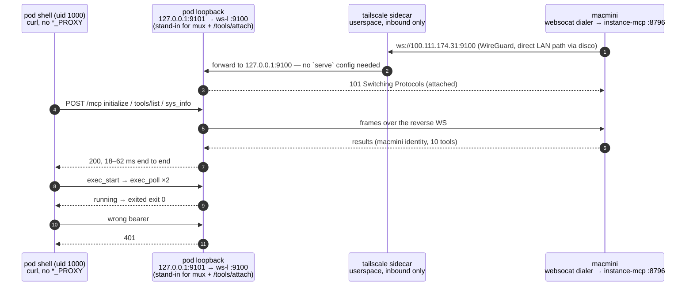
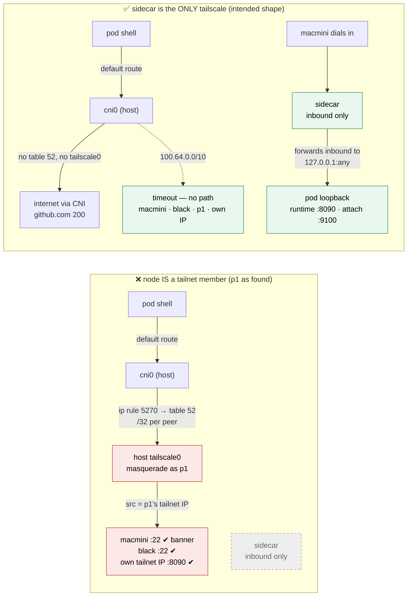

# Requirement — reverse attach: macmini dials the sandbox, the sandbox has no egress

> Recorded 2026-09-24. Implements **Phase 4** of
> [`connect-closed-loop.md`](connect-closed-loop.md): "Connect's agent (in the `openab-pty`
> sandbox) reaches macmini MCP over the tailnet." Supersedes the earlier *sandbox-egress*
> draft of the same day, which is summarised under "Rejected" below.

## Statement

A coding CLI (kiro-cli / claude / openab) runs inside the `openab-pty` sandbox — a k8s pod or
ECS task — and must be able to call `oab-instance-mcp` tools on macmini (screenshot / mouse /
key / osascript / exec) so the agent can drive the Mac while the human watches in Connect.

The sandbox shell has **no network identity of its own** (`uid 1000`, no host creds, read-only
rootfs); the tailscale sidecar is the pod's only tailnet identity and it is **inbound-only**
(tailnet → sidecar → loopback runtime). Every earlier idea started from "give the sandbox an
egress path". This document starts from the opposite premise: **the sandbox gets no egress at
all — macmini connects *in*.**

## Rejected — every egress-based variant shares one root flaw

Once the sandbox has *any* outbound tailnet path it is effectively a tailnet node, and
everything after that is patching:

| Variant | Flaw |
|---|---|
| sidecar as SOCKS/HTTP proxy + `HTTPS_PROXY` in the shell | honoring `HTTPS_PROXY` is a per-client convention (Node `fetch`/undici ignores it; raw `hyper`/custom Go transports ignore it); MCP's Streamable HTTP + SSE is proxy-hostile |
| agent holds the bearer token and connects itself | token lands in the shell (`uid 1000`, prompt-injectable) — breaks openab-pty's "the shell never holds a credential" invariant |
| runtime holds the token and reverse-proxies to macmini (the earlier draft) | keeps the token out of the shell, but a compromised agent can still bind its own loopback relay to the sidecar's egress and reach **any** tailnet node; needs destination lock-down + ACLs, and per-tool scoping would mean parsing MCP inside a proxy (fragile) |

All three require changing the sidecar from inbound-only to inbound+egress. Removing egress
removes the whole class of problems.

### Considered 2026-09-25 — ACL-scoped egress (viable, not chosen)

A fourth variant deserves its own entry because it is *not* broken, only weaker: keep an
egress path but pin it with a Tailscale ACL, `tag:oab-pty → tag:instance-mcp:<port>` only.
This fixes the one flaw of variant 3 (a compromised agent reaching *any* tailnet node) and
needs less new code than reverse attach. It was not chosen for these reasons:

| Aspect | ACL-scoped egress | Reverse attach |
|---|---|---|
| How egress physically works | The sidecar is `--tun=userspace-networking` on both k8s and ECS (`deploy/`), so there is no tun device: egress exists only as a tailscaled SOCKS5/HTTP proxy that clients must *opt into*. Either the shell sets `HTTPS_PROXY` (per-client convention; token in the shell) or the runtime forwards loopback→SOCKS5 (variant 3 + ACL). Kernel mode would need `NET_ADMIN`+`/dev/net/tun`, which Fargate does not have | none; sidecar unchanged |
| Granularity of trust | ACL is **per tag, per port**: every pod carrying the tag can reach every Mac carrying the other tag, forever, until the policy is edited (control-plane propagation). Per-session grant / TTL / revoke must be rebuilt as a server-side allowlist on instance-mcp | per session, TTL'd, revoked by deleting the verifier — native |
| Dependency on Tailscale policy correctness | the security boundary now includes the ACL file: the default `src:["*"], dst:["*:*"]` rule (present on most tailnets) silently defeats the tag rule; ACL is port-level, and macmini's `tailscale serve :443` multiplexes other services (e.g. the OTA server), so granting `:443` grants all of them unless instance-mcp moves to a dedicated port | no ACL dependency; the pod initiates nothing, so an over-permissive ACL changes nothing |
| Identity | tagged nodes carry no user login; instance-mcp could authenticate by `tailscale whois <src>` tag or an ACL `grants` app-capability (`openab.dev/cap/instance-mcp: [{profile}]`) — a clean pattern, but it moves tool-profile policy into the ACL file | macmini chooses the profile at dial time; nothing to look up |
| New code | runtime loopback→SOCKS5 forwarder; instance-mcp allowlist + whois; ACL change + audit; sidecar flag | runtime `WS /tools/attach` + loopback mux; instance-mcp WS client + per-connection tool list |

If reverse attach ever proves unworkable, ACL-scoped egress is the fallback — **with** the
runtime forwarder (never `HTTPS_PROXY` in the shell), a dedicated instance-mcp port in the
ACL, an audited policy with the default allow-all rule removed, and the per-session grant kept
on the instance-mcp side.

## Decision — reverse attach

```
  openab-pty pod                                        macmini
  ┌──────────────────────────────────────────┐          ┌──────────────────────────────┐
  │  agent CLI          runtime              │          │  oab-instance-mcp            │
  │  ┌──────────┐    ┌──────────────────┐    │          │  ┌────────────────────────┐  │
  │  │ mcp.json │    │ loopback MCP     │    │          │  │ reverse-attach client  │  │
  │  │127.0.0.1 ├───►│ listener (mux)   │    │          │  │  holds the credential  │  │
  │  │ no token │    │        ▲         │    │          │  │  picks a tool profile  │  │
  │  └──────────┘    │        │         │    │          │  │  (sandbox: no exec)    │  │
  │                  │ /tools/attach    │◄───┼── WSS ───┼──┤                        │  │
  │                  │ (sha256 verifier)│    │ inbound  │  └────────────────────────┘  │
  │                  └──────────────────┘    │  only    └──────────────────────────────┘
  │   sidecar: inbound only — UNCHANGED      │                       ▲
  │   no egress of any kind                  │                       │ "lend my Mac to this
  └──────────────────────────────────────────┘                       │  session, 1h" — human,
                                                                     │  in OpenAB Connect
```

1. **openab-pty runtime** gains an inbound endpoint `WS /tools/attach` on its existing
   loopback listener (reached through the sidecar's existing `tailscale serve`, exactly like
   `/pty/{session}` today), credentialed the same way the admin plane is: the pod stores only
   a `sha256:` **verifier**, never a usable secret.
2. **macmini (`oab-instance-mcp`)** gains a **reverse-attach client**: it dials
   `wss://<pod>.<tailnet>.ts.net/tools/attach`, authenticates with a credential *it* holds, and
   serves MCP over that socket.
3. The runtime exposes a **loopback MCP listener** (`http://127.0.0.1:<port>/mcp`) for the
   agent and multiplexes requests over the reverse socket. The agent's `mcp.json` points at a
   plain local URL: no token, no TLS, no proxy, and its HTTP stack is irrelevant.
4. **Tool profile is chosen by macmini per attach.** macmini *is* the MCP server, so scoping
   is a per-connection tool list in `MCPServer` — `tools/list` returns the profile's tools and
   `tools/call` rejects anything else. No MCP parsing in a proxy. The `sandbox` profile
   excludes `exec`/`exec_start` (or gates them on Connect approval, below).

### Who tells macmini which pod to dial — the human, in Connect or Remote

Pods are ephemeral; macmini cannot be configured with them. Connect already lists both PTY
sessions and Mac agents. The user selects a PTY session and chooses **"lend my Mac to this
agent"** with a profile and a TTL; the client (human credential, over the tailnet) calls a new
admin endpoint on `oab-instance-mcp` — `POST /attach {runtime, session, profile, ttl}` — and
macmini dials in. The grant is **explicit, per-session, time-bounded, revocable**, and made
in the same app where the human watches the screen. This completes the closed loop: the human
watches *and* authorises from one place.

**Both OpenAB Connect (Mac) and OpenAB Remote (iPhone) can issue the grant.** The grant is a
single authenticated HTTP call; everything that follows (dialling the pod, holding the socket,
enforcing the TTL) happens on macmini. The granting device does not need to stay online — the
phone can be put away after the tap. "I allow you to use my Mac mini for one hour" is exactly
this call from the phone.

#### How a grant works

```
  Connect / Remote                 oab-instance-mcp (macmini)                openab-pty pod
  ────────────────                 ──────────────────────────                ──────────────
  1. pick PTY session,
     profile, TTL
  2. POST /attach ───────────────► authenticate the human (existing
     Authorization: Bearer <human>   AuthPolicy: tailnet login AND bearer,
     {runtime, session,              see authn.md)
      profile, ttl}
                                  3. mint an attach secret; store
                                     grant {session, profile, expires}
                                  4. hand the sha256 verifier to the
                                     pod's admin plane ────────────────────► store verifier for
                                     (admin credential held by macmini)      that session only
                                  5. dial wss://<pod>/tools/attach ────────► verify, accept
                                     with the secret; serve MCP with
                                     the profile's tool list
  ◄── 202 {grant_id, expires} ────
                                  6. TTL reached, or DELETE /attach/{id}
                                     from any client ──► close socket,
                                     drop secret ─────────────────────────► verifier deleted;
                                                                             tools/list → "not attached"
```

Notes on the grant model:

- **Grant lives on macmini**, not on the granting device. Connect and Remote are equal
  clients of the same endpoint; a grant made from the phone can be revoked from the Mac and
  vice versa (`GET /attach` lists active grants).
- **Attribution.** The grant record carries the human login that authorised it (from
  `Tailscale-User-Login`, see `authn.md`) and is written to `agent.log` with every tool call
  made under it — "who lent the Mac to which session, for how long".
- **Profile is part of the grant**, fixed for its lifetime. Widening (e.g. adding `exec`)
  is a new grant, not an edit, so the audit trail stays honest.
- **Renewal** is a new `POST /attach` for the same session before expiry; macmini rotates the
  secret and keeps the socket. Nothing auto-renews.
- **Mint path for the verifier (step 4)** — 4b implements **both**, exactly one per request:
  `admin_credential` (macmini calls the pod's `POST /admin/sessions/{s}/tools-attach` with it,
  uses it for that request only, keeps nothing; the runtime's TTL wins) or `secret` (the
  client minted at the pod itself and hands macmini the result). Connect/Remote can pick
  either; the grant record stores neither value.

Alternative rendezvous (both sides dial `openab-cp`) is viable and aligns with the openab-pty
→ CP-runtime direction, but adds a third component; not needed for the first cut.

## Prior art

Reverse attach is the ordinary shape for "a device with hands joins a hub it cannot be dialled
from": the side that owns the capability dials out, the hub multiplexes. Nothing here is new;
the table records where each piece comes from and the one place the analogy inverts.

### OpenClaw node ↔ gateway

The closest match. OpenClaw's gateway is a WebSocket hub; companion nodes (macOS / iOS /
Android apps) dial it, go through a device-pairing approval, advertise their capabilities
(`system.run`, screen, camera, …), and the agent's `nodes` tool routes commands to a paired
node over that socket.

| OpenClaw | Reverse attach |
|---|---|
| gateway — WS server, the hub | openab-pty runtime `WS /tools/attach`, reached through the existing `tailscale serve` |
| node (macOS app) dials the gateway | `oab-instance-mcp` on macmini dials the pod |
| device pairing — a human approves the node | admin plane mints an attach verifier = "lend my Mac to this session" in Connect |
| node advertises capabilities | macmini's `tools/list` per profile (`sandbox` omits `exec*`) |
| agent's `nodes` tool routes to the node | runtime's loopback `127.0.0.1:<port>/mcp` muxes the CLI's MCP requests over the reverse socket |
| node protocol is OpenClaw-specific | plain MCP JSON-RPC frames over WS; the mux needs only `id` |

**Where the analogy inverts — and why "who dials whom" is the only hard part.** In OpenClaw
the *hub* is long-lived with a fixed address and the *nodes* are ephemeral, so a node always
knows where to dial. Here the hub (the pod) is ephemeral and the node (macmini) is the
long-lived one. That is why macmini must be *told* which pod to dial (`POST /attach` from
Connect) and why retry/reconnect ownership sits on macmini, the dialer: when a pod is
recreated the verifier is gone with it, Connect re-mints, and macmini keeps redialling for the
remainder of the grant TTL.

### Other dial-out designs with the same reasoning

| System | Pattern borrowed |
|---|---|
| `cloudflared` / ngrok tunnels | the origin dials the edge and never listens on a routable address; the edge multiplexes inbound requests over the tunnel — same "no inbound path, no egress needed on the other side" property, mirrored |
| GitHub Actions self-hosted runners / ARC | the runner (the side with hands) dials out and long-polls for jobs; the control plane never dials the runner and needs no ACL onto it |
| `ssh -R` reverse tunnel | a listener on the far side forwards back over a connection the near side initiated; the mux-by-connection idea |
| openab-pty's own admin plane | the pod stores a `sha256:` verifier and never a usable secret; `/tools/attach` reuses the same verifier store and constant-time compare — see the "two invariants" in the openab-pty README |

## Threat model — what this does and does not stop

| Threat | Result |
|---|---|
| sandbox needs a tailnet egress path | **none needed**; sidecar unchanged |
| credential in the pod that a compromised shell could steal | **none** — pod holds a sha256 verifier only; a verifier cannot be used to connect anywhere |
| compromised agent reaches other tailnet nodes | **impossible** — no egress to bypass through |
| compromised agent uses macmini's full shell via `exec` | **blocked by profile** — the `sandbox` profile omits `exec`, or requires a human tap in Connect (the human is already watching the screen) |
| compromised agent calls the tools it *was* granted | **residual, by design** — giving an agent hands carries this in every design; the difference is the hands are exactly as large as the human chose, for as long as they chose |
| macmini's attach credential leaks | attacker could serve a fake `/tools/attach`? No — the credential authenticates macmini *to the pod*; a leaked one lets an attacker impersonate macmini to that pod, not reach macmini. Mint per-attach, TTL'd, revoke by deleting the verifier |
| **the k8s node itself is a tailnet member** (homelab k3s boxes often are) | **out of scope, must be documented as an assumption** — pods ride the node's tailscale routing (`ip rule … lookup 52` → `tailscale0`, masqueraded as the node) and reach every tailnet peer regardless of the sidecar. Measured on p1 in 4a: with the host's tailscaled running the shell reached macmini/black over their tailnet IPs; with it stopped, no path at all. Deployment rule: **no tailscaled on the node**; if unavoidable, an egress `NetworkPolicy` denying `100.64.0.0/10` + `fd7a:115c:a1e0::/48`. Fargate has no such path |
| pod forges `Tailscale-User-Login` over the attached socket | **instance-mcp must not trust that header on `/tools/attach` traffic** — today `AuthPolicy` accepts it from a loopback peer because `tailscale serve` is assumed to be the peer; over reverse attach the loopback peer is the attach client and the header originates in the pod. Identity of a request on the attached socket is the *grant*, nothing in the request |

## Split of work

| Side | Change |
|---|---|
| `openabdev/openab-pty` | `WS /tools/attach` inbound endpoint with sha256-verifier auth (reuse admin-plane pattern); loopback MCP listener (`127.0.0.1` only, enforced) that multiplexes to the attached socket; admin op to mint/revoke an attach verifier for a session; deploy manifests unchanged (sidecar stays inbound-only) |
| `oab-instance-mcp` (this repo) | reverse-attach client (WSS dial, reconnect, teardown when the pod disappears); per-connection **tool profiles** in `MCPServer` (`owner` = everything, `sandbox` = no `exec*`); admin endpoint `POST /attach` for Connect (human-credentialed, existing `AuthPolicy`); optional `exec` approval hop via Connect |
| OpenAB Connect **and** OpenAB Remote | "lend my Mac to this session" action → `POST /attach`; list/revoke grants; approval prompt for gated tools. Both are clients of the same endpoint |

## Phasing

| Phase | Deliverable | Depends on |
|---|---|---|
| 4a | ✅ **Done 2026-09-26** — see "4a results" below and [openab-pty#37](https://github.com/openabdev/openab-pty/issues/37). Protocol spike, no product code: `websocat` reverse WS from macmini into the pod's loopback; MCP round-trips (`sys_info`, `exec_start`/`exec_poll`) from a shell pointed at the pod's loopback port | a tailnet-enrolled pod |
| 4b | ✅ **Done 2026-09-26** — openab-pty [#38](https://github.com/openabdev/openab-pty/pull/38) (`/tools/attach` + loopback mux + `CLIENT-CONTRACT.md` §9); this repo: `ReverseAttachClient`, `ToolProfile` (`owner` / `sandbox` = no `exec*`), `AttachManager` + `POST/GET /attach`, `DELETE /attach/{id}`. Verified end to end **over the real tailnet** (laptop → macmini `POST /attach` via `tailscale serve` → macmini mints at the p1 pod and dials in → the session shell's `OPENAB_TOOLS_MCP_URL` → sandbox `tools/list` without `exec`, forced `exec` refused, `sys_info` in 12 ms, `DELETE /attach/{id}` → pod `ToolsDetach`). Found and fixed on the way: ATS in the .app bundle blocks plaintext tailnet URLs ([#8](https://github.com/openabdev/instance-mcp/pull/8)). Log: [openab-pty#37](https://github.com/openabdev/openab-pty/issues/37) | 4a |
| 4c | Connect + Remote "lend my Mac" UI + TTL + revoke; `exec` approval prompt | 4b + Connect/Remote |

## Verification (4a, measurement discipline)

- Test the **real hop**: macmini → pod inbound → loopback mux → agent. A laptop-direct call to
  macmini proves nothing about the pod.
- From inside the shell: `curl http://127.0.0.1:<port>/healthz` with **no** `*_PROXY` set.
- One `sys_info` and one streaming call end to end; confirm `tools/list` under the `sandbox`
  profile does **not** contain `exec`, and that a forced `tools/call exec` is rejected.
- Confirm from inside the shell that **no** outbound tailnet path exists (`curl` to another
  tailnet node fails) — this is the property the design is buying.

## 4a results (2026-09-26, real pod on p1, `oab-instance-mcp` 0.4.0 on macmini)

Full log in [openab-pty#37](https://github.com/openabdev/openab-pty/issues/37). Stand-ins: `websocat -E -b ws-l:127.0.0.1:9100 tcp-l:127.0.0.1:9101` in the pod shell container (uid 1000) for `/tools/attach` + the loopback listener; `websocat -E -b ws://<pod>:9100 tcp:127.0.0.1:8796` on macmini as the reverse-attach client, into a bearer-only instance-mcp.

| Check | Result |
|---|---|
| inbound WS to a pod loopback port through the userspace sidecar | 101 — this deployment has no `tailscale serve`; the sidecar forwards inbound tailnet TCP to the pod's loopback for **any** port, so `/tools/attach` needs no serve config |
| from the shell, `*_PROXY` unset: `healthz`, `initialize`, `tools/list`, `sys_info` ×3 | all 200; 18–62 ms end to end (direct LAN path found by disco) |
| job-style call: `exec_start` + `exec_poll` | `running` → `exited exit 0`, output intact |
| wrong bearer | 401 |
| `tools/list` under the `sandbox` profile has no `exec*` | not testable in 4a (profiles are 4b); today the list has `exec`, `exec_start`, `exec_poll`, `exec_list`, `exec_cancel` |
| shell → any tailnet node, **host tailscaled running** | ❌ reached macmini/black/p1 and its own tailnet IP, as the node — see threat model row |
| shell → any tailnet node, **host tailscaled stopped** (intended shape) | ✅ timeout to every target incl. its own tailnet IP; loopback runtime and CNI internet egress unchanged |

### What was measured, as a picture

The spike hop — the same shape 4b will implement, with `websocat` standing in for both ends:



The egress assertion, in the two node shapes that were measured. Only the right-hand one is
the intended deployment:



Carry-overs into 4b:

- **Exactly one attach per session, enforced by the runtime.** Two dialers redialling the same session raced the loopback bind (`Address in use`), 418 failed attaches and a `TIME_WAIT` storm in minutes. Replace-with-close-code or refuse; never let the dialer spin.
- **Dialer must tolerate the pod going dark.** For ~8 min p1 (host and pod) could not complete TLS to the Tailscale control plane while other LAN hosts could; the pod showed `offline` and a fresh dialer had no path. Redial for the grant TTL with backoff.
- **A pod that is replaced needs a fresh `TS_AUTHKEY`.** The key stored in the k8s secret on p1 is already dead (`invalid key: API key does not exist`); the running sidecar lives on its persisted node state only. Reconnect-after-pod-restart therefore also depends on the operator's key hygiene, not just on Connect re-minting the verifier.
- openab-pty runtime as container PID 1 does not reap orphans (`<defunct>` accumulate) — separate small fix there.

## Open questions

- Reconnect semantics when the pod restarts under the same session name; who owns retry
  (macmini, since it is the dialer).
- One attach per PTY session vs one per pod; per-session gives clean attribution in
  `agent.log` and matches the Connect grant model.
- Whether `exec` in the `sandbox` profile is "absent" or "present but approval-gated"; start
  with absent, add gating when Connect has the prompt.
- Framing on the reverse socket: raw MCP JSON-RPC frames over WS is simplest; the mux only
  needs a per-request correlation id it already has (`id`).
- Behaviour on the loopback listener when **no Mac is attached**: proposed — `tools/list`
  returns an empty list plus a single `instance_status` tool that answers "not attached", so
  the agent can tell "no hands were lent" from "the endpoint is broken"; a `503` would read
  as a fault.

## Decision record

The decision, the alternatives and their rejection reasons are recorded as an ADR in
[`docs/adr/reverse-attach.md`](../adr/reverse-attach.md); this document holds the full design,
threat model, phasing and prior art.
